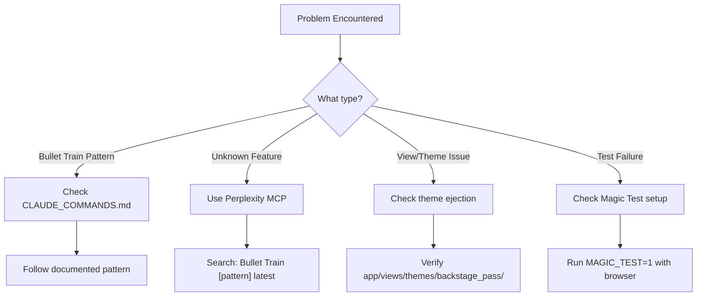

# Claude Code Workflow - Backstage Pass Project

## 🚀 Session Start Protocol (Every Time)

### Step 1: Context Check (30 seconds)
```bash
# 1. Verify setup status
bash .claude/pre-flight.sh

# 2. Check current task
rake claude:status

# 3. Quick file check
ls app/views/themes/backstage_pass/ | head -5  # Must see files!

# 4. View current sprint
grep "@current" TASKS.md
```

### Step 2: Review Documentation Hierarchy
```bash
# Read in this order:
1. QUICKSTART.md           # Quick reminders
2. grep "⚠️\|❌" claude.md  # Critical rules
3. tail -30 TASKS.md       # Current work items
4. head -20 CLAUDE_COMMANDS.md  # Command syntax
```

### Step 3: Perplexity MCP Integration

**Use Perplexity MCP to research when:**
- Uncertain about Bullet Train patterns
- Need latest Rails 8 features
- Checking LiveKit/Mux documentation
- Verifying gem configurations

```markdown
# Example Perplexity queries for this project:

1. "Bullet Train super_scaffold latest syntax for nested resources with ownership chain"
2. "LiveKit Ruby SDK token generation with Rails 8"
3. "Mux Ruby gem live streaming setup 2024"
4. "Hotwire Native iOS bridge pattern for video streaming"
5. "Rails 8 Turbo Streams with ActionCable for real-time updates"
```

## 📋 Task Execution Flow

### For Each Task:

#### 1. Research First (if needed)
```bash
# Use Perplexity MCP for:
- "How does Bullet Train handle [specific pattern]?"
- "Best practice for [technical challenge] in Rails 8"
- "Latest documentation for [gem/service]"
```

#### 2. Check Existing Patterns
```bash
# Before creating anything new:
grep -r "class.*Controller" app/controllers/  # See controller patterns
grep -r "🚅" app/models/                      # Find models with magic comments
ls app/views/themes/backstage_pass/           # Check available views
```

#### 3. Execute with Super Scaffold
```bash
# ALWAYS use super_scaffold (never rails generate model)
rails generate super_scaffold ModelName Parent,Team field:type

# Then configure:
1. Run migrations: rake db:migrate
2. Edit locale file: config/locales/en/modelname.en.yml
3. Add associations (preserve 🚅 comments!)
4. Create Magic Test
```

#### 4. Test & Verify
```bash
# After each feature:
rails console  # Test model creation
rails test     # Run tests
MAGIC_TEST=1 rails test test/system/  # UI testing
```

#### 5. Update Progress
```bash
# Mark task complete
rake claude:complete["task description"]

# Move to next
rake claude:next

# Commit work
git add .
git commit -m "Complete: [task description]"
```

## 🎯 Current Sprint Focus

### Phase 1: Core Models (Week 1)
```bash
# Execute in order:
1. Space model (marketplace storefront)
2. Experience model (what users buy)
3. AccessPass model (purchases)
4. Stream model (live streaming)
5. Configure all button options in locale files
6. Add associations between models
```

### Phase 2: Services (Week 2)
```bash
1. LiveKit service integration
2. Mux service for distribution
3. Payment processing with Pay gem
4. Access control implementation
```

## 🔍 Decision Tree for Problems



## 📊 Daily Checklist

### Morning Start
- [ ] Run `bash .claude/pre-flight.sh`
- [ ] Check `rake claude:status`
- [ ] Review current task in TASKS.md
- [ ] Pull latest changes: `git pull`

### During Development
- [ ] Use super_scaffold for ALL models
- [ ] Preserve 🚅 magic comments
- [ ] Configure button options in locale files
- [ ] Create Magic Tests for features
- [ ] Use Perplexity for unclear patterns

### Before Break/End
- [ ] Run tests: `rails test`
- [ ] Update task status: `rake claude:complete[task]`
- [ ] Commit changes: `git commit -m "Progress: [description]"`
- [ ] Note blockers in TASKS.md

## 🚨 Red Flags to Watch For

If you see these, STOP and check documentation:

1. **No files in `app/views/themes/backstage_pass/`** → Theme not ejected!
2. **Missing 🚅 comments in models** → Super scaffolding will break!
3. **Using `rails generate model`** → Must use super_scaffold!
4. **Options not showing in UI** → Configure locale files!
5. **Tests failing** → Check Magic Test setup!

## 💡 Perplexity MCP Query Templates

### For Bullet Train Issues:
```
"Bullet Train [version] super_scaffold [specific feature] correct syntax"
"Bullet Train magic comments 🚅 purpose and requirements"
"Bullet Train theme ejection process and file structure"
```

### For Streaming Features:
```
"LiveKit Ruby SDK Rails 8 integration example 2024"
"Mux live streaming with Ruby on Rails hybrid distribution"
"WebRTC to HLS transcoding strategy for scalable streaming"
```

### For Mobile:
```
"Hotwire Native iOS Swift bridge for LiveKit video streaming"
"Turbo Native Android WebRTC integration pattern"
"Hotwire Native double-tap gesture handling"
```

## 🎬 Quick Commands Reference

```bash
# Most used commands for this project:
alias bp='cd ~/backstage-pass'
alias bpss='rails generate super_scaffold'
alias bpstatus='rake claude:status'
alias bpnext='rake claude:next'
alias bptest='MAGIC_TEST=1 rails test test/system/'
alias bpcheck='bash .claude/pre-flight.sh'

# Quick model generation:
bpss Space Team name:text_field status:buttons --sidebar="ti-building"
rake db:migrate
vi config/locales/en/spaces.en.yml  # Configure buttons
```

## 📈 Progress Tracking

Current Week: **Week 1 - Core Models**
- [x] Project setup
- [x] Theme ejection
- [ ] Space model
- [ ] Experience model  
- [ ] AccessPass model
- [ ] Stream model
- [ ] LiveKit service
- [ ] Mux service

**Next Milestone**: Working marketplace with live streaming (Week 2)

---

**Remember**: 
1. ALWAYS use super_scaffold
2. NEVER delete 🚅 comments
3. Research with Perplexity when uncertain
4. Test with Magic Test
5. Maintain team context