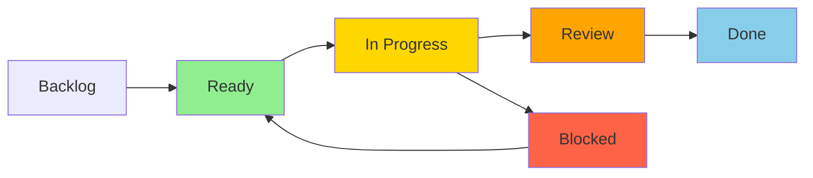

# GitHub Task Management System (Enhanced)

This document describes the comprehensive GitHub-based task management workflow with Projects, Milestones, and automatic synchronization for Backstage Pass development.

## 🎯 Overview

We use GitHub Issues + Projects + Milestones as the single source of truth for tasks, with bidirectional sync to local development environment and automatic priority management for AI assistance.

## 📊 Architecture

```
GitHub (Source of Truth)
├── Issues (Tasks)
│   └── Labels (Status, Priority, Sprint, Component)
├── Projects (Kanban Board)
│   └── Phase 1 MVP, Phase 2, Phase 3
└── Milestones (Time-boxed Sprints)
    └── Week 1-4 Sprints

    ↕️ Bidirectional Sync
    
Local Development
├── AI_CURRENT_TASKS.md (Prioritized task list)
├── AI_CONTEXT.md (Current task context)
└── .github/
    ├── issues/ (JSON cache)
    └── sync-status.json (Sync state)
```

## 🔄 Workflow States



### State Definitions with Label Mapping

| Project Column | Status Label | AI Label | Description |
|---|---|---|---|
| **Backlog** | `status/exploring` | - | Research & discovery |
| **Ready** | `status/ready` | `ai/ready` | Ready for implementation |
| **In Progress** | `status/executing` | `ai/working` | Active development |
| **Review** | `status/review` | `ai/complete` | In PR review |
| **Done** | - | - | Closed and merged |
| **Blocked** | `status/blocked` | `ai/needs-human` | Needs intervention |

## 🏷️ Label System (Complete)

### Priority Labels
- `priority/critical` - 🔴 Do immediately (blocks progress)
- `priority/high` - 🟡 Do soon (important features)
- `priority/medium` - 🟢 Normal priority
- `priority/low` - ⚪ Nice to have

### Status Labels
- `status/exploring` - Research needed
- `status/planning` - Being defined
- `status/ready` - Ready to start
- `status/executing` - In progress
- `status/blocked` - Can't proceed
- `status/review` - In PR review

### AI Workflow Labels
- `ai/ready` - ✅ Ready for AI implementation
- `ai/working` - 🔄 AI currently working
- `ai/complete` - ✔️ AI work done
- `ai/needs-human` - 🙋 Needs human input

### Sprint Labels
- `sprint/week-1` - Week 1 Foundation
- `sprint/week-2` - Week 2 Streaming
- `sprint/week-3` - Week 3 Marketplace
- `sprint/week-4` - Week 4 Polish

### Component Labels
- `component/auth` - Authentication
- `component/models` - Data models
- `component/streaming` - LiveKit/video
- `component/payments` - Stripe/billing
- `component/ui` - Frontend
- `component/mobile` - Hotwire Native

### Type Labels
- `type/feature` - New functionality
- `type/bug` - Something broken
- `type/enhancement` - Improvement
- `type/docs` - Documentation
- `type/tech-debt` - Code quality

## 📅 Milestones & Projects

### Phase 1 MVP Milestones

| Milestone | Duration | Focus | Key Deliverables |
|---|---|---|---|
| **Week 1: Foundation** | 7 days | Core models, auth, routing | Space/Experience models, passwordless auth |
| **Week 2: Streaming** | 7 days | LiveKit integration | Stream management, real-time features |
| **Week 3: Marketplace** | 7 days | Payments, access | Stripe integration, access passes |
| **Week 4: Polish** | 7 days | Testing, mobile | Hotwire Native, documentation |

### GitHub Projects

**Phase 1 MVP Board**
- Columns: Backlog → Ready → In Progress → Review → Done
- Automation: Labels trigger column moves
- Views: By Sprint, By Priority, By Component

## 🤖 Enhanced AI Workflow Commands

### Core Commands

```bash
# ALWAYS START HERE (at conversation beginning)
bin/gh-sync                          # Sync all issues, projects, milestones

# Check what's available
bin/gh-project-status                # View project board
bin/gh-milestone-status              # Check milestone progress
bin/gh-milestone-status "Week 1"     # Check specific milestone

# Work on issues
bin/gh-start <issue-number>          # Start working (creates branch, context)
bin/gh-complete <issue-number> "PR"  # Complete and create PR

# Project management
bin/gh-project-move <issue> "Ready"  # Move issue on board
bin/gh-project-move <issue> "In Progress"
bin/gh-project-move <issue> "Review"
```

### Setup Commands

```bash
# One-time setup
bin/gh-setup-labels                  # Create all labels
bin/gh-setup-milestones             # Create Week 1-4 milestones

# Automatic sync
bin/gh-auto-sync once                # Single sync
bin/gh-auto-sync watch 60           # Watch mode (check every 60s)
bin/gh-auto-sync daemon 300         # Background daemon (5 min intervals)
bin/gh-auto-sync status             # Check daemon status
bin/gh-auto-sync stop               # Stop daemon
```

## 📋 AI Task Priority Algorithm

The enhanced `gh-sync` follows this priority order:

1. **🔴 CRITICAL + ai/ready** - Blocking issues
2. **🟡 HIGH + ai/ready** - Important features
3. **📅 Current Sprint + ai/ready** - This week's work
4. **⏰ Current Milestone + ai/ready** - This phase
5. **📋 Other ai/ready** - Backlog items

## 🔄 Automatic Synchronization

### Continuous Sync Options

**1. Cron Job (Recommended for Production)**
```bash
# Add to crontab -e
*/5 * * * * cd /path/to/backstage-pass && bin/gh-auto-sync once
```

**2. Watch Mode (Development)**
```bash
# Terminal window
bin/gh-auto-sync watch 60  # Check every 60 seconds
```

**3. Background Daemon**
```bash
# Start daemon
bin/gh-auto-sync daemon 300  # 5-minute intervals

# Check status
bin/gh-auto-sync status

# Stop daemon
bin/gh-auto-sync stop
```

### Sync Status Monitoring

The system maintains `.github/sync-status.json`:
```json
{
  "last_sync": "2025-09-15T10:30:00Z",
  "critical_count": 0,
  "ready_count": 5,
  "working_count": 1,
  "blocked_count": 0,
  "stale_count": 0
}
```

## 📝 Issue Templates

### Feature Template
```yaml
name: Feature Request
title: "[FEATURE] "
labels: ["type/feature", "status/exploring"]
body:
  - User Story (As a... I want... So that...)
  - Acceptance Criteria
  - Component selection
  - Priority selection
```

### Task Template
```yaml
name: Implementation Task
title: "[TASK] "
labels: ["status/ready", "ai/ready"]
body:
  - Parent issue reference
  - Implementation steps
  - AI instructions
  - Super-scaffold commands
```

## 🚀 Complete AI Workflow Example

```bash
# 1. Morning startup routine
bash .claude/gh-preflight.sh         # Check GitHub integration
bash .claude/pre-flight.sh           # Check project setup
bin/gh-sync                          # Sync all tasks

# 2. Review status
cat AI_CURRENT_TASKS.md             # See prioritized list
bin/gh-project-status                # Check board
bin/gh-milestone-status              # Check sprint progress

# 3. Start highest priority
bin/gh-start 123                     # Creates branch, updates labels

# 4. Work on issue
# - Follow AI_CONTEXT.md
# - Implement feature
# - Run tests

# 5. Complete work
bin/gh-complete 123 "Add Stream model with LiveKit"

# 6. Auto-sync for next task
bin/gh-sync                          # Get next priority item
```

## 🎯 AI Instructions Summary

**CRITICAL RULES FOR AI:**

1. **ALWAYS run `bin/gh-sync` at conversation start**
2. **NEVER create models without checking existing issues**
3. **ALWAYS work on priority/critical first**
4. **NEVER leave issues in ai/working state**
5. **ALWAYS complete with `bin/gh-complete`**
6. **ALWAYS check AI_CURRENT_TASKS.md for work**

## 📊 Benefits

1. **Single Source of Truth** - GitHub is authoritative
2. **Automatic Prioritization** - AI always works on most important
3. **Full Visibility** - Team sees all progress on GitHub
4. **Bidirectional Sync** - Work flows both ways
5. **Context Preservation** - AI_CONTEXT.md maintains focus
6. **Sprint Alignment** - Automatic milestone/sprint tracking

## 🔧 Troubleshooting

### Common Issues

**No AI-ready tasks:**
```bash
# Check all open issues
gh issue list --state open

# Make issue AI-ready
gh issue edit <number> --add-label "ai/ready"
```

**Sync not working:**
```bash
# Check authentication
gh auth status

# Re-authenticate
gh auth login

# Check repo
gh repo set-default todddickerson/backstage-pass
```

**Stale working issues:**
```bash
# Find stale issues
gh issue list --label "ai/working" --state open

# Reset to ready
gh issue edit <number> --add-label "ai/ready" --remove-label "ai/working"
```

## 📈 Metrics & Reporting

Track progress with:
```bash
# Sprint velocity
gh issue list --milestone "Week 1" --state closed | wc -l

# AI productivity
gh issue list --label "ai/complete" --created ">$(date -d '7 days ago' '+%Y-%m-%d')"

# Blocked items
gh issue list --label "status/blocked" --state open
```

---

This enhanced system provides complete GitHub integration with automatic prioritization, continuous sync, and full project/milestone tracking for optimal AI-assisted development!